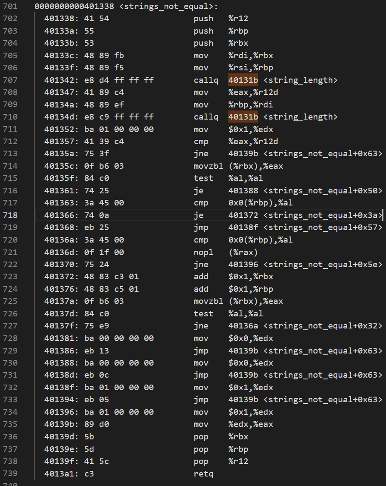
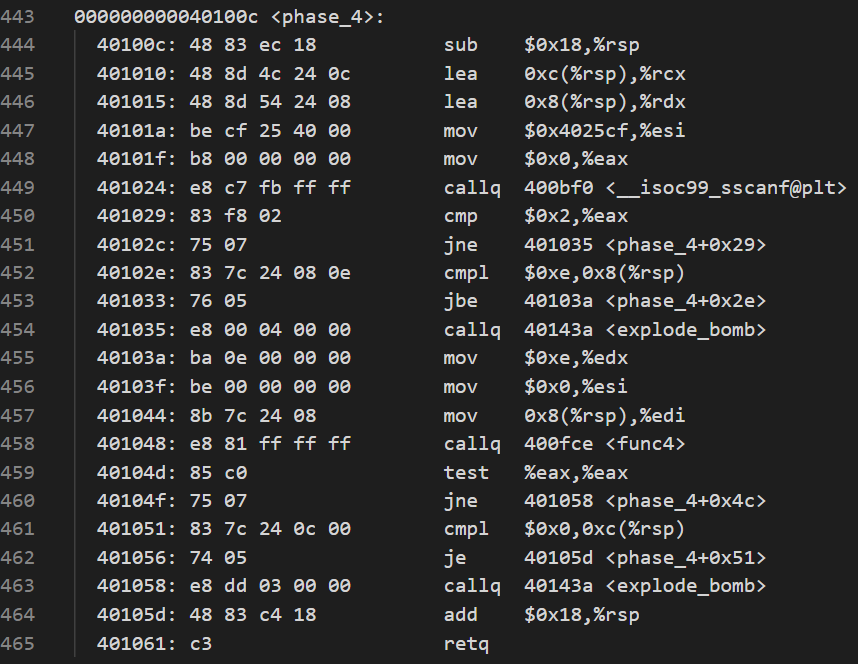
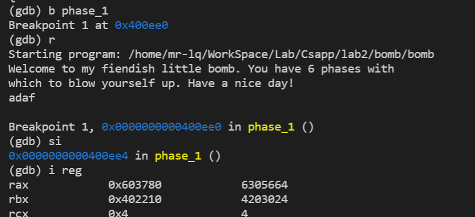

### Csapp Lab2: bomb

---

#### 简介

> 总共有6个炸弹，需要闯关者输入6个正确的字符串依次过关。此次lab主要是逆向工程的应用。要求能看得懂汇编代码，需要会用gdb、objdump相关工具等。提供可执行文件还有省略的c文件。

#### 相关命令

> objdump -d 可执行文件名  #进行反汇编，出来的是汇编代码
>
> objdump -t 可执行文件名  #查看可执行文件中的符号表，里面有符号的段信息以及整个符号占了多少字节
>
> gdb 可执行文件 #进入gdb环境中，输入q退出gdb环境，输入r执行可执行文件

> 由于反汇编文件过于长，导致终端无法完全显示，因此将反汇编出来的内容重定向到一个文件中。dasm.txt是整个可执行文件进行反汇编出来的汇编代码，symbol.txt是符号表。

```bash
objdump -d ./bomb > dasm.txt
objdump -t ./bomb > symbol.txt
```

> 以main这个符号为例：


> 在符号表中可以看到main这个符号在.text段中，段首地址为0000000000400da0，main所在的.text段总字节为0x137，这些就是main函数在运行过程中的实际地址

> 查看反汇编代码如图：


> 可以看到起始地址为0x400da0，结束地址为0x400ed6，所以总长度为0x400ed6-0x400da0+1=0x137。
>
> 好了，简单介绍之后，让我们开始拆炸弹吧。

---

#### phase_1


>  查看这段代码的反汇编文件




> 1. 首先我们根据Csapp知道，函数调用中寄存器%rax作为返回结果，%rdi，%rsi，%rdx，%rcx依次为函数的第1，2，3，4个参数
>
> 2. 可以看到read_line这个函数调用后结果返回到%rax寄存器中，然后phase_1(input)，将第一个形参（即input的内容）赋给%rdi，之后调用phrase_1函数
>
> 3. 查看函数phase_1的汇编代码，可以看到将立即数0x402400送到寄存器%esi当中，由1中分析我们知道%si寄存器是第二个参数位置，然后调用了strings_not_equal函数，如果返回值是0，则je条件成立，跳到0x400ef7地址中，然后恢复栈帧，返回；否则就会触发explode_bomb函数
>
> 4. 查看strings_not_equal函数的汇编代码如图。
>
>    我们知道，%rdi是自己输入的字符串，%rsi是内置的字符串，首先调用string_length函数，判断两个字符串的长度是否相等，如若不相等（也就是第712行判断二者长度是否一致）直接返回1；否则，我们从714行开始看，如果%al为0后，则跳转，函数返回0，经分析我们可以知道%al为0的时候其实是遍历到了字符串末端（c语言中字符串以NULL结尾），现在我们来看717行，可以看到在进行0x0(%rbp)和%al的比较，而%al其实就是(%rbx)（714行），然后再看705行和706行，%rbx和%rbp其实就是自己输入的字符串和系统内置的字符串。
>
>    因此，这个函数的思想就是对输入的字符串和系统内置的字符串比较，此外，需要了解的知识点就是寄存器存的是字符串的地址，（寄存器）其实就是解引用，将字符串对应的地址的值给取出来。
>
>    所以，经过以上分析，我们可以知道系统内置的字符串的起始地址是0x402400，利用gdb将其打印出来。所以答案是：“Border relations with Canada have never been better.”


> 好了，第一个炸弹成功被拆除，现在让我们进入第二阶段。除了用p能打印信息之外，用x命令也能查看对应的内存信息，如查看字符串信息x/s 字符串首地址

---

#### phase_2

> 要过这题是很容易的，坑点所在是read_six_num最开始看的云里雾里的，还是和phase_1一样
>
> 坑点所在，需要知道sscanf的参数

```c
int sscanf(const char* str, const char* format,...)
//返回值：该函数返回成功匹配和赋值的个数。如果到达文件末尾或发生读错误，则返回EOF。
//该函数功能：会将参数str的字符串根据参数format字符串来转换并格式化数据
```


> 上图为phase_2的反汇编代码，我们暂且先跳过read_six_numbers函数的汇编代码。
>
> 首先，我们对其进行栈帧分析，如下图。


> 观察上面汇编代码，我们可以知道每个相邻内存单元里面的值都是两倍关系，而M[%rsp]=1（362行可知），因此我们心中大概有个底了，这6个数应该就是1 2 4 8 16 32。好了，现在我们再去看read_six_numbers函数去验证一下。sscanf(%rdi, %rsi, %rdx, %rcx, %r8, %r9...)


> sscanf的第一个参数%rdi是我们从stdin输入的字符串，%rsi是格式化字符，前面四个%d分别存在%rdx, %rcx, %r8, %r9，还有多的两个存在栈帧（%rsp）(第五个%d)，0x8(%rsp)（第六个%d）中。因此，进一步验证了我们前面的输入是正确的。
>
> 答案：1 2 4 8 16 32


---

#### phase_3

> 有了phase_2关于sscanf知识点的补充分析，这题其实挺简单的，奈何jmp间接跳转的机制都搞错了，在这题中是取内存当中对应的值（M[x]）为目标跳转地址，而我少了解引用（也就是取出内存单元对应的值，M[内存单元]）。（csapp忘得差不多了呜呜）。下面进行分析。


> 观察上述反汇编代码可以知道sscanf接收了四个参数，sscanf(%rdi, %rsi, %rdx, %rcx)
>
> %rdi就是我们自己输入的字符串，让我们来看看%rsi的内容（387行）（利用p (char *) addr或者x/s addr都可以查看），如下


> 这样我们就能够推出sscanf(str, "%d %d", &变量1,&变量2)，思想就是从我们输入的字符串中格式化出两个整数。变量1的值为M[%rsp+0x8]，变量2的值为M[%rsp+0xc]，lea只是取到计算作用，我们观察385、386行可以知道吧变量1的地址送给%rdx，变量2的地址送到%rcx中，这也符合我们上述的分析。
>
> 然后我们来看396行，这用到了jmp间接引用。
>
> - jmp直接引用：jmp label
> - jmp间接引用：jmp *%rax（跳到地址为%rax的值）/ jmp *(%rax) （跳到地址为M[%rax]中）
>
> 下面两张图分别是间接引用和直接引用的示例。


> 396行中的代码可以等价为M[0x402470+8*%rax]，因此查看M[0x402470]的内容


> 由393行我们知道输入的第一个变量不能大于7，否则直接会失败。
>
> 当%rax为0时，间接跳转到0x00400f7c，然后将0xcf送到%eax中，之后跳转到400fbe上，对%eax和变量2的值进行判断，如果相等则不会引爆炸弹，因此0x0, 0xcf即为一个答案
>
> 接着往下分析，间接跳转理论上也能跳转到400f83，然后把变量2的值赋为0x2c3也可以，现在我们来查看下当%rax为1的时候，M[0x402470+8=0x402478]=0x400fb9，然后变量2的值就为0x137了。因此0x1，0x137也是一个答案。还需要注意的点是sscanf中的第二个参数是"%d %d"，因此要用十进制输入。
>
> 所以一个答案为0  207，另一个还可以为1  311


---

#### phase_4

> 同前面一样，也是从键盘（stdin）或者文件中输入一个字符串，然后调用phase_4函数，根据phase_4的反汇编代码推断出输入的字符串该为何字符串。



> 有了前面几关的详细分析，我们大概知道了sscanf的用途了，这对于我们看懂汇编代码有比较大的帮助。
>
> 443行-450行可以认为是属于sscanf的范畴，进行的操作就是sscanf(%rdi, %rsi, %rdx, %rcx)，需要注意的是lea指令只进行地址运算，不进行解引用。sscanf进行翻译就是sscanf(input, "%d %d",  &变量1, &变量2)，input是自己输入的字符串。如果返回值不是2那么直接爆炸。然后调用func4（变量1, 0, e），如果函数func4返回0，并且变量2的值是0，则成功不引爆炸弹，那么现在我们的关键是解读func4。


> func4(变量1, 0, e)=func(%rdi, %rsi, %rdx)。
>
> 观察这个func4函数发现它是一个递归函数，应该是在匹配某个值。这里特别观察一下426行，其实csapp里好像是没有这个写法的，sar %eax就是%eax=%eax/2，只进行右移一位，这也是我参考了相关资料才知道的。
>
> 当代码第一次运行到427行的时候，这时%edi是变量1的值，%ecx的值是7。
>
> 如果变量1>=7，则跳转到400ff2。
>
> - 如果7>=变量1，此时变量1为7，则跳转到401007处，这时候进行返回，并且返回值是0；
> - 如果变量1>7，那么接着调用func4(变量1, 7+1, e)
>
> 如果变量1<7，那么接着调用func4(变量1, 0, 6-1)
>
> **函数思想**就是利用二分找到变量1，变量1在0~0xe之间。经过上面分析，我们可以得到变量1为7，这时候func4返回值是0，满足炸弹不爆炸的条件。因此，答案就是7   0。

#### phase_5

> 要解决此题，首先要了解为了防止栈溢出有用栈金丝雀的手段，简言之就是在栈中放入某一数值，当函数返回时检查此值有没有被改变即可，如果被改变，那么栈发生了溢出，否则没发生溢出。让变量填入过多的时候就可能会覆盖掉金丝雀的值，发生栈溢出。


下图中的两段代码便是栈金丝雀的判断


> 现在让我们来看完整代码，首先进行字符串长度(string_length)的判断可以确定我们输入的字符串长度必须为6，否则会触发爆炸。接着往下分析，在代码第一次执行到480行的时候，代码将我们输入的字符数组的第一个数值（ascii值）赋给了%ecx，然后将第一个字符的数值存入了栈顶(%rsp)中，然后取出字符数值的低四位，现在到了484行，之后将字符ascii数值的低四位作为偏移访问ox4024b0，然后将访问到的值赋给M[%rsp+1*%rax+0x10]，之后接着循环六次。
>
> 后面对以%rsp+0x10为起始地址的字符串何以0x40245e为起始地址的字符串进行比较，如若二者相等，那么这个炸弹将顺利拆除。
>
> 我们先来观察下0x4024b0和0x40245e到底存了些什么。


> 所以，经过以上分析，我们知道我们输入的字符串在0x4024b0这一数组中的偏移顺序要满足flyers这些字符在0x4024b0数组中的出现次序。举个例子详细说明一下，因为第一个字符要是f，而f在数组中的偏移量是9，然后我们知道a的ascii值是0x61，A的ascii的值是0x41，那么什么字符的ascii值的低四位是9呢，b是0x62，依此类推，i是0x69（I是0x49），正好是9，因此我们输入的第一个字符要是i/I。
>
> 总结一下：就是我们输入的字符的低四位的值作为偏移对数组0x4024b0进行访问，访问的结果要是flyers。
>
> 所以，答案为ionefg，当然大写的也可以。

#### phase_6

> 好家伙，最开始看到的是我人傻了，这汇编也太长了吧，吐了。这题花了我特别久，还是太菜了呜呜。
>
> 耐着性子做吧。这百来行的汇编真的快看吐血了，看了一下午
>
> 是不是在循环啊，感觉是链表。
>
> 这题可以分为好几个部分。

##### part I


> 有一定汇编基础的人仔细读上面的代码应该可以理解，过程有点繁琐。大概意思就是有一个数组a[0-5]，总共有6个元素，每个元素都要小于等于6，并且6个元素当中要互不相同。

##### part II


> part II的过程就是给栈中的数组元素依次用7去减它，因此现在得到的数组是b[0-5]，其中b[i]=7-a[i]

part III


> 这是最关键的一步，让我们来识别它的真面目。我们从第557行来突破，我们先来看一下地址为0x6032d0里面装的到底是什么。需要注意的是机器是小端序（高位在高地址，低位在低地址），因此node1的next地址是0x006032e0正好存的是node2的地址，应该是个链表，并且地址是顺序的；再观察一下，每个node应该是一个结构体，里面有值和index，看node1，我们知道节点1的值是332(十进制)，索引是1，其他节点依此类推。
>
> 好了，知道这其实是一道链表题后，我们来分析part III到底在干嘛。如果b[i]=1的话，那么代码会从564行跳到557行，然后就是M[%rsp+0x20+2\*%rsi]开始存储0x6032d0，就是说 M[%rsp+0x20+2\*%rsi]的值是地址。现在我们讲述的数组的起始地址是%rsp+0x20
>
> 我们观察下上述代码，思想是这样的。
>
> 如果b[i]的值是1，那么就把0x6032d0也就是node1的地址赋给数组。如果b[i]的值是2，那么就把node2的地址赋给数组，...，如果b[i]的值是i，那么就把nodei的地址赋给数组，这其实就是对b[0-5]的值进行重排。


##### part IV


> 这部分就是对上述从%sp+0x20为起始地址的数组进行连接。就是M[%rsp+0x20]->M[rsp+0x28]...，形成一个新的链表。

##### part V


> 历经周折，我们终于到了最后一部分了。这部分就是对part IV中形成的新链表进行从高到低排序。如果满足从降序排列，那么将不会引爆炸弹。


> 现在让我们来看链表的具体值。分别是332, 168, 924, 691, 477, 443。要将其从大到小排列就是node3, node4, node5, node6, node1, node2。
>
> 由上面的分析可以知道：如果b[i]的值是i，那么就把nodei的地址赋给数组。所以以%sp+0x20为起始地址数组的值就是3, 4, 5, 6, 1, 2，所以b数组的值就是3, 4, 5, 6, 1, 2，所以a数组的值就是4, 3, 2, 1, 6, 5


#### 总结




> - 我在做bomb这个实验的时候基本都是用眼睛看的，而没有用gdb单步调试的手段orz，原因是gdb还用的不熟吧，没有这个意识。其实是需要学会用gdb对汇编进行单步调试。
> - phase_6看了特别久，大体思路看明白了，但是忘记怎么去看node的值了，人傻了。最终还是稍微参考了
> - [CSAPP:Lab2-Bomb Lab - 知乎 (zhihu.com)](https://zhuanlan.zhihu.com/p/138448999)
>
> - 要懂得利用gdb的x命令去查看内存中特定地址的值，以及知道step，stepi，next，nexti的区别，带i的是执行一条机器语言，不带i的是执行一条高级语言代码，s/si会跳进函数，n/ni不跳进函数，直接执行下一行。b 行号/函数名可以打断点，si能跳进函数内部（在汇编层面），info reg或者layout reg能够显示进入这个函数的寄存器信息，disassemble 函数名能够进行反汇编。
>
> - 好像还有彩蛋，phase_6这汇编看的我恶心了，我暂时就先不做彩蛋了。

