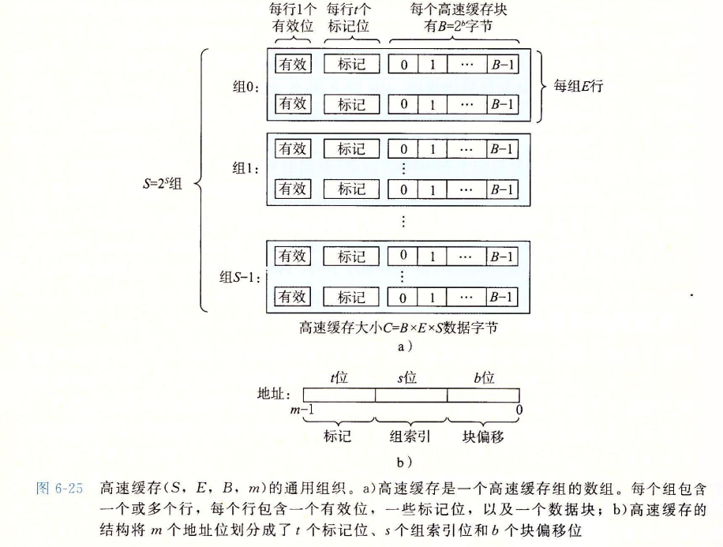
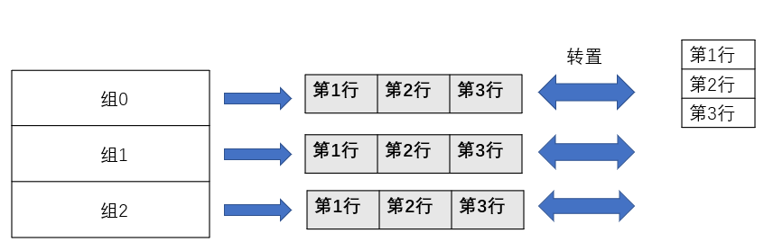
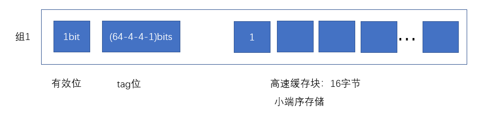
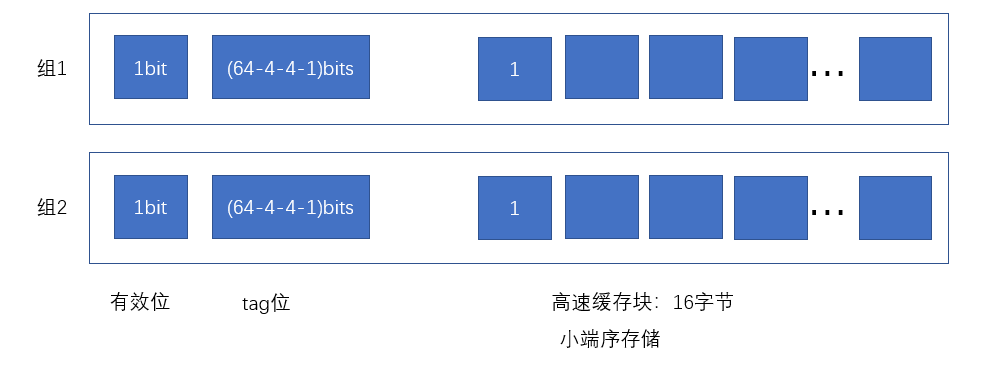
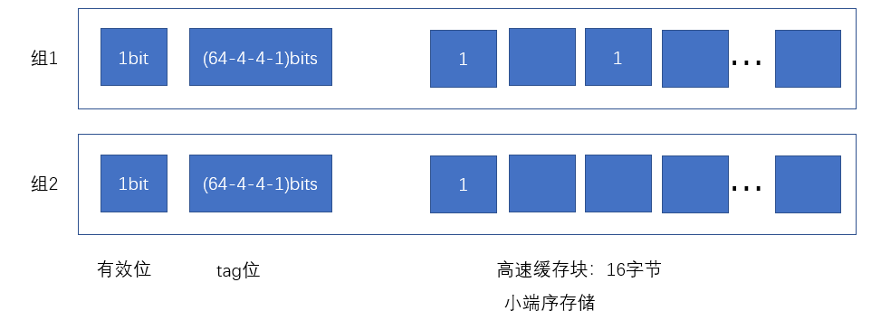
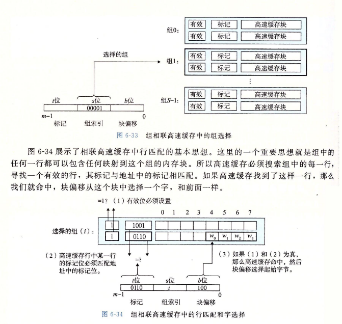
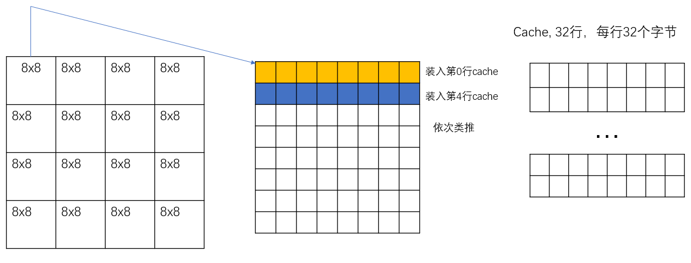

### Cache Lab

#### 工具

> - Valgrind：是一个提供了一些debug和优化的工具的工具箱，可以使得程序减少内存泄漏或者错误访问
> - install 
>
> ```bash
> sudo apt install valgrind
> ```

#### Part A: Writing a Cache Simulator

> - 直接相连映射，比较简单，直接取模替换即可
> - 组相联映射，组间直接相联（主存中的某块映射到哪个组是固定的），组内全相连（主存中的某块映射到该组的哪一块是灵活的）。几路组相联映射，那么每个组内就有多少块（也就是多少行）
> - 全相联映射，主存的某块能映射到Cache特定组的任意一块




> - 需要我们实现LRU策略的Cache。我们知道正常使用java来实现LRU的话，那就是通过HashMap+双向链表（LinkedHashMap）进行实现的，现在我们用C语言来实现Cache
> - operation address, size
> - 这里解释一下tracefile中的L、S、M、address、size是什么意思
>   - L：load data
>   - S：store data
>   - M：modify data，先load再store
>   - address：往对应的主存地址存或者取数据
>   - size：指定操作访问的字节数

#### 二维指针的使用（可以引入指针数组进行理解）

```cpp
#include<iostream>

int main()
{
    int ** p;
    // p = (int **)malloc(10*sizeof(int ));//p指向一个指针
    p = new int *[10];
    for (int i = 0; i < 10; i++) {
        // *(p + i ) = (int *)malloc(10sizeof(int));
        *(p + i) = new int[10];
    }   
    for (int i = 0; i <= 9; i++) {
        for (int j = 0; j <= 9; j++)
            p[i][j] = 0;
    }
    for (int i = 0; i <= 9; i++) {
        for (int j = 0; j <= 9; j++) {
            std::cout << p[i][j];
        }
        std::cout << std::endl;
    }
    return 0;
}
```


>- 二重指针相当于指针数组，数组中的每个元素都是一个指针，然后这个指针又指向一维数组，需要注意每个空间都需要进行开辟
>- 可以用这种方式来进行Cache模拟，示意图如下



> - 可以和上图6-25结合起来对比。
>
> - 挑一部分例子进行解释：./csim-ref -v -s 4 -E 1 -b 4 -t traces/yi.trace
>
>   - 从输入命令的参数中可以得知总共有16组（s=4），每个组内只有一行(E=1)，每行有16个字节
>
>   - ```tex
>      L 10,1
>      M 20,1
>      L 22,1
>     //改写为
>     L 00010000, 1
>     //块偏移：0000，组索引：0001,说明在第一组
>     M 00100000, 1
>     //块偏移：0000，组索引：0010,说明在第二组
>     L 00100010, 1
>     //块偏移：0010，组索引：0010,说明在第二组
>     ```
>
>   - 此时Cache示意图如下：
>
>     
>
>   - 然后进行M 20, 1，M操作相当于先L，然后再S
>
>   - 此时的Cache示意图如下：
>
>     
>
>   - 然后进行L 22,1操作，因为tag位和组一展示的一样，因此Cache命中，此时Cache示意图如下：
>
>     
>
> - Cache命中，组相连替换步骤：
>
>   - 根据16进制地址写成2进制表示
>   - 判断组索引是多少组，然后进入到对应组中搜索所有行
>   - 然后检查对应的tag位是否相等，需要注意的是这里无需再额外判断有效位了，因为如果它无效的话，然后输入的参数合法，他们的tag位是不会相等的，并且输入的地址是只关注tag位，组索引和块偏移的，有效位是针对缓存地址来说的，而不是输入的主存地址来说的。因此只需要判断tag位是否相等来判断cache是否命中即可。
>   - 如果tag相等，那么命中；否则需要装入或者进行替换
>     - 如果组内的每一行有效位都已经置为1，那么说明没有空行，需要进行替换
>     - 如果组内有某些行有效位是-1，那么说明有空行，则装入即可
>
>   
>
> - 代码如下

```c
#include "cachelab.h"
#include<stdio.h>
#include<string.h>
#include<stdlib.h>
#include <getopt.h>

int h, v, s, S, E, b, t;

typedef struct {
    int valid_bit; //每行一个有效位
    int tag_bits; //t个标记位
    int timestamp;  //时间戳,为LRU算法做准备
}cache_line;

cache_line** cache = NULL;

char tracePath[100] = {0};
FILE *fp;
int hits = 0, misses = 0, evictions = 0;

//print -h content
void printHelp() {
    printf("Usage: ./csim-ref [-hv] -s <num> -E <num> -b <num> -t <file>\n"
            "Options:\n"
            "  -h         Prints usage info.\n"
            "  -v         Displays trace info.\n"
            "  -s <s>   Number of set index bits.\n"
            "  -E <E>   Number of lines per set.\n"
            "  -b <b>   Number of block offset bits.\n"
            "  -t <tracefile>  Trace file.\n\n"
            "Examples:\n"
            "  linux>  ./csim-ref -s 4 -E 1 -b 4 -t traces/yi.trace\n"
            "  linux>  ./csim-ref -v -s 4 -E 1 -b 4 -t traces/yi.trace\n");
}

// 用二维数组模拟Cache
void initCache() {
    cache = (cache_line **)malloc(sizeof(cache_line *) * S);
    for (int i = 0; i < S; i++) {
        *(cache + i) = (cache_line *)malloc(sizeof(cache_line) * E);
    }
    for (int i = 0; i < S; i++) {
        for (int j = 0; j < E; j++) {
            cache[i][j].valid_bit = 0;
            cache[i][j].tag_bits = -1;
            cache[i][j].timestamp = -1;
        }
    }

}

//进行LRU策略,对于自己输入的addr没有valid可言,valid是仅仅对cache来谈的
void update (unsigned int addr) {
    int set_index = (addr >> b) & ((-1U) >> (64-s));
    int tag = addr >> (b+s);

    //查看tag有没有命中
    for (int i = 0; i < E; i++) {
        if (cache[set_index][i].tag_bits == tag) {
            cache[set_index][i].timestamp = 0;
            hits++;
            printf("hit\n");
            return;
        }
    }

    //查看有无空行
    for (int i = 0; i < E; i++) {
        if (cache[set_index][i].valid_bit == 0) {
            cache[set_index][i].valid_bit = 1;
            cache[set_index][i].tag_bits = tag;
            cache[set_index][i].timestamp = 0;
            misses++;
            printf("miss\n");
            return;
        }
    }

    int max_timestamp = -2;
    int max_timestamp_index = -1;
    //需要替换, 利用LRU策略进行替换. 替换掉最大的时间戳
    misses++;
    evictions++;
    printf("evictions\n");
    for (int i = 0; i < E; i++) {
        if (cache[set_index][i].timestamp > max_timestamp) {
            max_timestamp = cache[set_index][i].timestamp;
            max_timestamp_index = i;
        }
    }
    cache[set_index][max_timestamp_index].tag_bits = tag;
    cache[set_index][max_timestamp_index].timestamp = 0;
    cache[set_index][max_timestamp_index].valid_bit = 1;

}

void update_timestamp() {
    for (int i = 0; i < S; i++) {
        for (int j = 0; j < E; j++) {
            if (cache[i][j].valid_bit) {
                cache[i][j].timestamp++;
            }
        }
    }
}

void read_trace() {
    
    //fp在main函数中已经赋值
    char op;
    unsigned int addr;
    int size;
    while (fscanf(fp, " %c %x,%d", &op, &addr, &size) > 0) {
        // fflush(fp);
        if (v)
            printf("%c %d %d \n", op, addr, size);
        switch(op) {
            case 'L':
                update(addr);
                break;
            case 'S':
                update(addr);
                break;
            case 'M':
                update(addr); //load
                update(addr); //store
                break;
        }
        update_timestamp();
    }
    fclose(fp);
    for (int i = 0; i < S; i++) {
        free(cache[i]);
    }
    free(cache);
    return;


}
int main(int argc, char *argv[])
{

    char c;
    /* parse command line args */
    while ((c = getopt(argc, argv, "hvs:E:b:t:")) != -1) {
        switch (c) {
            case 'h': /* help */
                printHelp();
                break;
            case 'v': 
                v = 1;
                break; 
            case 's': 
                s = atoi(optarg);
                break;
            case 'E': 
                E = atoi(optarg);
                break;
            case 'b': 
                b = atoi(optarg);
                break;
            case 't': 
                strcpy(tracePath, optarg);
                break;
            default:
                printf("./csim failed to parse its options.\n");
                exit(1);
                
	    }
    }

    //前置条件
    if (s <= 0 || E <= 0 || b <= 0 || !strlen(tracePath)) {
        printf("Invalid param. \n");
        exit(1);
    }
    

    //打开文件
    if ((fp = fopen(tracePath, "r")) == NULL) {
        printf("Fail to open file!\n");
        exit(1);
    }

	//组数
    S = 1 << s;

    initCache();
    read_trace();
    //hits, misses, evictions
    printSummary(hits, misses, evictions);
    return 0;
}

```


### Part B: Optimizing Matrix Transpose

> - 题目给的cache的参数是(s=5, E=1, b=5)，相当于是直接相联映射，cache中的每行有32个字节（也就是8个int数）,然后有32行，题目给了分块能减少miss的提示。

> - 32x32
>
>   - 整个Cache相当于能装32*8个int数，对半分也就是16x8个int数，当然最理想的状态就是每次分块读A写B的时候都能够将cache充满。但是呢，A矩阵和B矩阵相同位置的元素是映射在同一cache行上的，因此一次最多充满情况就只能是8x8了，下面进行简单分析一下。
>   - 首先呢，对于A\[0\]\[0\]-A\[0\]\[7\]当然是命中cache的第0行的，因为矩阵分块，因此下一个遍历的元素是A\[1\]\[0\]-A\[1\]\[7\]，因为cache是直接相连映射，然后A矩阵的尺寸又是32*32，因此A\[1\]\[0\]-A\[1\]\[7\]是命中cache第4行的，依次类推A\[7\]\[0\]-A\[7\]\[7\]是命中cache第28行的
>
>   
>
>   - 让我们来大致分析一下将矩阵分成8x8的小矩阵的miss率。原矩阵记为A，目标矩阵记为B。在8x8范围内，对于A矩阵，read操作会miss8次，对于B矩阵，write操作会miss8次。需要注意的是要引入中间变量（如解法4所示），如果不引入中间变量的话，读取A的时候第一次会miss，然后将A的行装入，然后写入B的时候又会进行替换，这就没有用到cache的特性了。大大加大了开销；如果引入中间变量，那么直接第一次读的时候会miss，后7次读的时候都hit，只有前8次写的时候会miss，后面56次写的时候都不会miss。
>
>   ```c
>   void transpose_submit(int M, int N, int A[N][M], int B[M][N])
>   {
>       int i, j;
>   
>       // 解法1: miss 1183
>       // for (i = 0; i <  N; i++) {
>       //     for (j = 0; j < M; j += 8) {
>       //         B[j][i] = A[i][j];
>       //         B[j+1][i] = A[i][j+1];
>       //         B[j+2][i] = A[i][j+2];
>       //         B[j+3][i] = A[i][j+3];
>       //         B[j+4][i] = A[i][j+4];
>       //         B[j+5][i] = A[i][j+5];
>       //         B[j+6][i] = A[i][j+6];
>       //         B[j+7][i] = A[i][j+7];
>       //     }
>       // }
>   
>       // 解法2: miss 1183
>       // for (i = 0; i <  M; i++) {
>       //     for (j = 0; j < N; j += 8) {
>       //         B[i][j] = A[j][i];
>       //         B[i][j+1] = A[j+1][i];
>       //         B[i][j+2] = A[j+2][i];
>       //         B[i][j+3] = A[j+3][i];
>       //         B[i][j+4] = A[j+4][i];
>       //         B[i][j+5] = A[j+5][i];
>       //         B[i][j+6] = A[j+6][i];
>       //         B[i][j+7] = A[j+7][i];
>       //     }
>       // }
>   
>       // 解法3: misses: 343
>       // int k;
>       // for (i = 0; i < M; i += 8) {
>       //     for (j = 0; j < N; j += 8) {
>       //         for (k = i; k < i + 8; k++) {
>       //             B[j][k] = A[k][j];
>       //             B[j+1][k] = A[k][j+1];
>       //             B[j+2][k] = A[k][j+2];
>       //             B[j+3][k] = A[k][j+3];
>       //             B[j+4][k] = A[k][j+4];
>       //             B[j+5][k] = A[k][j+5];
>       //             B[j+6][k] = A[k][j+6];
>       //             B[j+7][k] = A[k][j+7];                
>       //         }
>       //     }
>       // }
>   
>       //解法4: misses: 287
>       int k, v0, v1, v2, v3, v4, v5, v6, v7;
>       for (i = 0; i < M; i += 8) {
>           for (j = 0; j < N; j += 8) {
>               for (k = i; k < i + 8; k++) {
>                   v0 = A[k][j];
>                   v1 = A[k][j+1];
>                   v2 = A[k][j+2];
>                   v3 = A[k][j+3];
>                   v4 = A[k][j+4];
>                   v5 = A[k][j+5];
>                   v6 = A[k][j+6];
>                   v7 = A[k][j+7];     
>                   B[j][k] = v0;
>                   B[j+1][k] = v1;
>                   B[j+2][k] = v2;
>                   B[j+3][k] = v3;
>                   B[j+4][k] = v4;
>                   B[j+5][k] = v5;
>                   B[j+6][k] = v6;
>                   B[j+7][k] = v7;               
>               }
>           }
>       }
>   }
>   ```
>
> - 64x64，此种情况和32x32的情况是类似的，此处就不再进行赘述了。

### 总结

> - 本实验个人认为是比较重要的实验，实现一个LRU Cache绝对是在面试过程中的基础。实现这个也能加深对Cache的理解。
> - 矩阵分块能减少cache的miss率，提高cache的利用率，当然，我们写程序的时候不会考虑到这么细节，但是知道这么一个道理对我们理解cache还是有不少帮助的。


