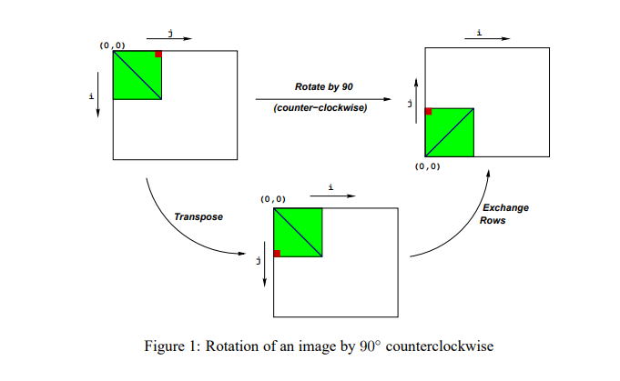
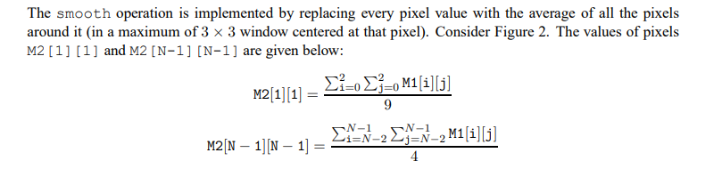
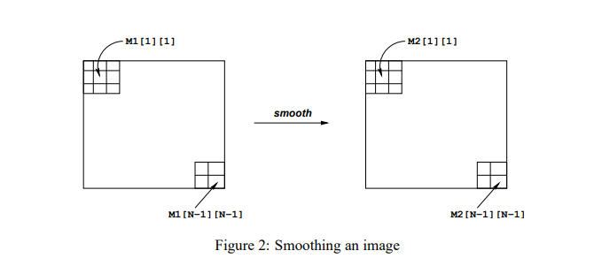
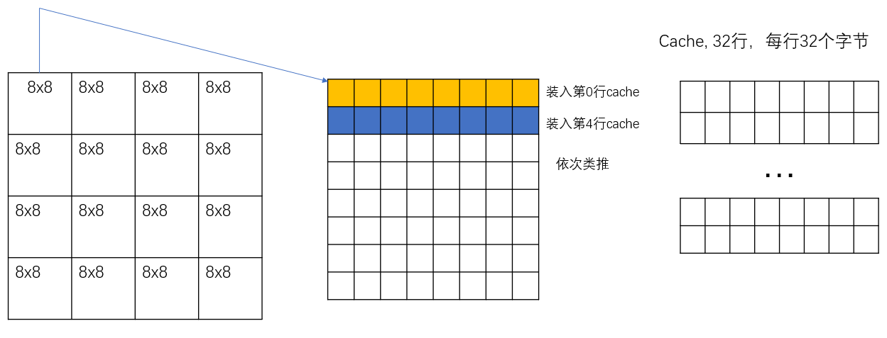

## Performance Lab

### 实验内容

> - 主要是利用Csapp中第五章中介绍的相关程序优化的内容来进行程序优化，有了前面的缓存实验做了一些基础，这个性能实验其实是很简单的，就是合理利用缓存、循环展开、矩阵分块、减少内存引用，减少不必要的函数调用等技术来优化程序运行的时间
> - 需要优化的函数主要有两个，一个是对图像进行旋转90度（rotate），还有一个是对图像进行平滑操作（smooth），会涉及到对矩阵进行相关的运算，我们需要优化这两个函数
> - rotate：先转置，然后再交换行（把第i行和第N-1-i行进行交换）
>
> 
>
> - smooth: 对图片进行平滑，也就是相当于是进行均值滤波（卷积）
>
>   
>
> - Cache的理论依据：
>
>   - 时间局部性：如果程序中的某条指令一旦执行，不久以后该指令可能再次执行;如果某数据被访问过，不久以后该数据可能再次被访问。专业说法：被引用过一次的存储器位置在未来会被多次引用，比如循环操作
>   - 空间局部性：一旦程序访问了某个存储单元，在不久之后，其附近的存储单元也将被访问。专业说法：如果一个存储器的位置被引用，那么将来他附近的位置也会被引用，比如cache
>
> - Cache有读命中和写命中，写命中的开销缩减会比读命中的开销缩减大

### Testing

```bash
make driver
./driver
```


### Optimizing Rotate

> - 前面的cache_lab有了一点铺垫，很容易想到用矩阵分块的思想
>
> - 矩阵分块
>
>   ```c
>   // need to optimize
>   void rotate(int dim, pixel *src, pixel *dst) 
>   {
>       // naive_rotate(dim, src, dst);
>       int i, j;
>       int s;
>       int t;
>       //经测试, 分的块数为16的时候效果最好
>       //1.矩阵分块 15.9
>       int block = 16;
>       for (i = 0; i < dim; i += block) {
>   	    for (j = 0; j < dim; j += block) {
>               for (s = i; s < i + block; s++) {
>                   for (t = j; t < j + block; t++) {
>                       dst[RIDX(dim-1-t, s, dim)] = src[RIDX(s, t, dim)];
>                   }
>               }
>           }
>       }
>   }
>   ```
>
> - 矩阵分块+内层循环展开
>
>   ```c
>   // need to optimize
>   void rotate(int dim, pixel *src, pixel *dst) 
>   {
>       // naive_rotate(dim, src, dst);
>       int i, j;
>       int s;
>       int t;
>       //经测试, 分的块数为16的时候效果最好
>       //1.矩阵分块 15.9
>       int block = 16;
>       for (i = 0; i < dim; i += block) {
>   	    for (j = 0; j < dim; j += block) {
>               for (s = i; s < i + block; s++) {
>                   for (t = j; t < j + block; t++) {
>                       dst[RIDX(dim-1-t, s, dim)] = src[RIDX(s, t, dim)];
>                   }
>               }
>           }
>       }
>   }
>   ```
>
> - 交换行列（写不命中开销比读不命中大）
>
>   ```c
>   // need to optimize 
>   void rotate(int dim, pixel *src, pixel *dst) 
>   {
>       // 14.4
>       int i, j;
>       for (j = 0; j < dim; j++)
>   	for (i = 0; i < dim; i++)
>   	    dst[RIDX(dim-1-j, i, dim)] = src[RIDX(i, j, dim)];
>   }
>   ```
>
> - 先交换行列，然后进行矩阵分块，然后再进行内层循环展开即可。

### Optimizing Smooth

> - 减少不必要的函数调用
>
>   - 我们发现原来的baseline在计算像素平均值的时候，在for循环里每次都调用max, min函数，大大的加大了开销，然后平均操作在最外围和中间的部分计算方式是不一样的，前面实验内容已经给出，很容易知道卷积的操作一般是去掉最外围的一层的，因此四个角落和四条边需要单独计算，至于内部的区域便可以统一计算
>   - 唯一需要注意的是除去四个角之后的四条边如何计算值，只需要处理6个像素
>
>   ```c
>   // 四个角
>   void set_corner(int cc, pixel *src, pixel *dst, int a1, int a2, int a3){
>       dst[cc].blue = (src[cc].blue+src[a1].blue+src[a2].blue+src[a3].blue) >> 2;
>       dst[cc].green = (src[cc].green+src[a1].green+src[a2].green+src[a3].green) >> 2;
>       dst[cc].red = (src[cc].red+src[a1].red+src[a2].red+src[a3].red) >> 2;
>   }
>   
>   void set_top(int dim, pixel *src, pixel *dst, int j){
>       dst[j].blue = (src[j].blue+src[j+dim].blue+src[j-1].blue+src[j+1].blue+src[j+dim-1].blue+src[j+dim+1].blue)/6;
>       dst[j].green = (src[j].green+src[j+dim].green+src[j-1].green+src[j+1].green+src[j+dim-1].green+src[j+dim+1].green)/6;
>       dst[j].red = (src[j].red+src[j+dim].red+src[j-1].red+src[j+1].red+src[j+dim-1].red+src[j+dim+1].red)/6;
>   }
>   
>   void set_bottom(int dim, pixel *src, pixel *dst, int j){
>       dst[j].blue = (src[j].blue+src[j-dim].blue+src[j-1].blue+src[j+1].blue+src[j-dim-1].blue+src[j-dim+1].blue)/6;
>       dst[j].green = (src[j].green+src[j-dim].green+src[j-1].green+src[j+1].green+src[j-dim-1].green+src[j-dim+1].green)/6;
>       dst[j].red = (src[j].red+src[j-dim].red+src[j-1].red+src[j+1].red+src[j-dim-1].red+src[j-dim+1].red)/6;
>   }
>   void set_left(int dim, pixel *src, pixel *dst, int i){
>       dst[i].blue = (src[i].blue+src[i-dim].blue+src[i-dim+1].blue+src[i+1].blue+src[i+dim].blue+src[i+dim+1].blue)/6;
>       dst[i].green = (src[i].green+src[i-dim].green+src[i-dim+1].green+src[i+1].green+src[i+dim].green+src[i+dim+1].green)/6;
>       dst[i].red = (src[i].red+src[i-dim].red+src[i-dim+1].red+src[i+1].red+src[i+dim].red+src[i+dim+1].red)/6;
>   }
>   void set_right(int dim, pixel *src, pixel *dst, int i){
>       dst[i].blue = (src[i].blue+src[i-dim].blue+src[i-dim-1].blue+src[i-1].blue+src[i+dim].blue+src[i+dim-1].blue)/6;
>       dst[i].green = (src[i].green+src[i-dim].green+src[i-dim-1].green+src[i-1].green+src[i+dim].green+src[i+dim-1].green)/6;
>       dst[i].red = (src[i].red+src[i-dim].red+src[i-dim-1].red+src[i-1].red+src[i+dim].red+src[i+dim-1].red)/6;
>   }
>   
>   void set_innner(int dim, pixel *src, pixel *dst, int k){
>       dst[k].blue = (src[k].blue+src[k-1].blue+src[k+1].blue+src[k+dim-1].blue+src[k+dim].blue+src[k+dim+1].blue+src[k-dim-1].blue+src[k-dim].blue+src[k-dim+1].blue)/9;
>       dst[k].green = (src[k].green+src[k-1].green+src[k+1].green+src[k+dim-1].green+src[k+dim].green+src[k+dim+1].green+src[k-dim-1].green+src[k-dim].green+src[k-dim+1].green)/9;
>       dst[k].red = (src[k].red+src[k-1].red+src[k+1].red+src[k+dim-1].red+src[k+dim].red+src[k+dim+1].red+src[k-dim-1].red+src[k-dim].red+src[k-dim+1].red)/9;
>   }
>   
>   // need to optimize
>   void smooth(int dim, pixel *src, pixel *dst) 
>   {
>   
>       //先对四个角进行赋值
>       //左上
>       set_corner(0, src, dst, 1, dim, dim+1); //[i][j] -> i*dim+j
>       //右上
>       set_corner(dim-1, src, dst, dim-2, dim+dim-1, dim+dim-2);
>       //左下
>       set_corner(RIDX(dim-1, 0, dim), src, dst, RIDX(dim-2, 0, dim), RIDX(dim-2, 1, dim), RIDX(dim-1, 1, dim));
>       //右下
>       set_corner(RIDX(dim-1, dim-1, dim), src, dst, RIDX(dim-1, dim-2, dim), RIDX(dim-2, dim-2, dim), RIDX(dim-2, dim-1, dim));
>   
>       int i, j;
>       //四条边
>       for(i = 1; i <= dim-2; i++){
>           set_top(dim, src, dst, i);
>           set_bottom(dim, src, dst, dim*dim-dim+i);
>           set_left(dim, src, dst, i*dim);
>           set_right(dim, src, dst, i*dim+dim-1);
>       }
>       //内部
>       for(i = 1; i <= dim-2; i++){
>           for(j = 1; j <= dim-2; j++){
>               set_innner(dim, src, dst, i*dim+j);
>           }
>       }   
>   }
>   ```
>
> - score: 22.4

### 简单思考为什么矩阵分块能提高速度

> - 矩阵分块能够减少缓存的miss率，所以肯定是从为什么矩阵分块能够减少矩阵转置操作缓存的miss率来考虑的
>
>   
>
> - 还是以上图为例，我们知道缓存是用来加速的，它肯定不可能很大，利用矩阵分块技术能够最大化缓存，什么意思呢，最简单的理解就是假设读和写在缓冲中的位置不冲突，各占一半。
>
> - 读和写一块小矩阵（比如8*8）的时候：
>
>   - 对于读操作：只有每一行的第一次会miss，后面都hit，也就是读64次只会miss8次
>   - 对于写操作，只有前8次写的时候会miss（写第0行第0列、第1行第0列、...），后面写的时候都会命中
>
> - 如果不进行矩阵分块，那就可能读，然后写的时候就把读操作命中的缓存给挤出来了，重复进行缓存内容的替换
>
> - 其实，矩阵分块技术也是时间局部性的一种体现

